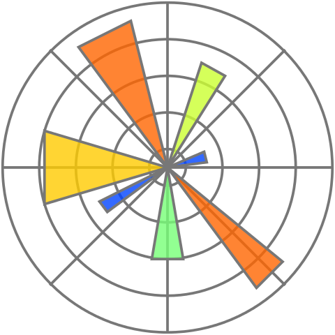

# SeConvNet
 
**A convolutional neural network using selective convolutional blocks for very high density salt-and-pepper noise removal in gray-scale and color images**

## Requirements
TensorFlow 

NumPy 

OpenCV 

scikit-image 

<!---Matplotlib  --->

## Training
Use this command to train the SeConvNet. You can change options (arguments) to your desired ones.
```
$ python train.py --noise_density 0.95 --image_channels 1 --epoch 50 --batch_size 128 --lr 1e-3 --train_dir data/Train --steps 2000
```
- noise_density
Noise density for salt-and-pepper noise. It should be in the interval [0, 1]. The default value is *0.95*.
- image_channels
Number of channels in noisy images. It is 1 for gray images and 3 for color images. The default value is *1*.
- epoch
Number of epochs in training. The default value is *50*.

- batch_size
Number of batches in training. It is 1 for gray images and 3 for color images. The default value is *1*.

- lr
Initial learning for Adam optimizer. The default value is *0.001*.

- train_dir
Path of training data. The default value is *data/Train*.

- steps
Number of steps per epoch in training. The default value is *2000*.

## Pre-trained Model
The pre-trained weights are stored in the *weights* folder.

## Testing
Use this command to test the SeConvNet. You can change options (arguments) to your desired ones.
```
$ python test.py --noise_density 0.95 --image_channels 1 --model_name model_050.hdf5 --test_dir data/Test --dataset BSD68 --result_dir results --save_result 0
```
- noise_density
- image_channels
- model_name
- test_dir
- dataset
- result_dir
- save_result

<!---## This repository contains the python codes for the implementation of the paper "[A convolutional neural network using selective convolutional blocks for very high density salt-and-pepper noise removal in gray-scale and color images](https://doi.org/10.1007/s12652-022-03747-7)".

Citation
Rafiee, A.A., Farhang, M. A convolutional neural network using selective convolutional blocks for very high density salt-and-pepper noise removal in gray-scale and color images. *Journal* (2022). https://doi.org/

[Download citation](https://)


### DOI
https://doi.org/

## Abstract
... --->
